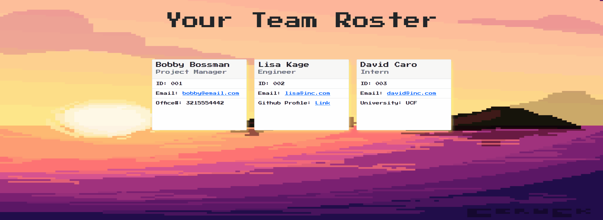

# team-profile-generator
Simplify your project's team roster with this profile generator
## 👨‍💻 Mission
Use Node.js to help user's quickly create a representation of a project's roster based on entered information.
## 💻 User Experience
To use the generator, follow these steps:
1. Fork this repo, download it to your PC
2. Open the folder directory in your terminal
3. Run ``npm install``
4. Run ``node index.js`` or ``npm start``
5. Answer the questions
6. Your Team Profile will generate in the ``/dist`` folder

An example of the steps can be shown here


## 🏁 Challenge Criteria
```md
GIVEN a command-line application that accepts user input
WHEN I am prompted for my team members and their information
THEN an HTML file is generated that displays a nicely formatted team roster based on user input
WHEN I click on an email address in the HTML
THEN my default email program opens and populates the TO field of the email with the address
WHEN I click on the GitHub username
THEN that GitHub profile opens in a new tab
WHEN I start the application
THEN I am prompted to enter the team manager’s name, employee ID, email address, and office number
WHEN I enter the team manager’s name, employee ID, email address, and office number
THEN I am presented with a menu with the option to add an engineer or an intern or to finish building my team
WHEN I select the engineer option
THEN I am prompted to enter the engineer’s name, ID, email, and GitHub username, and I am taken back to the menu
WHEN I select the intern option
THEN I am prompted to enter the intern’s name, ID, email, and school, and I am taken back to the menu
WHEN I decide to finish building my team
THEN I exit the application, and the HTML is generated
```
## 🎨 Preview
Here's an example of the whole process:


Here's an example of a generated profile page:
